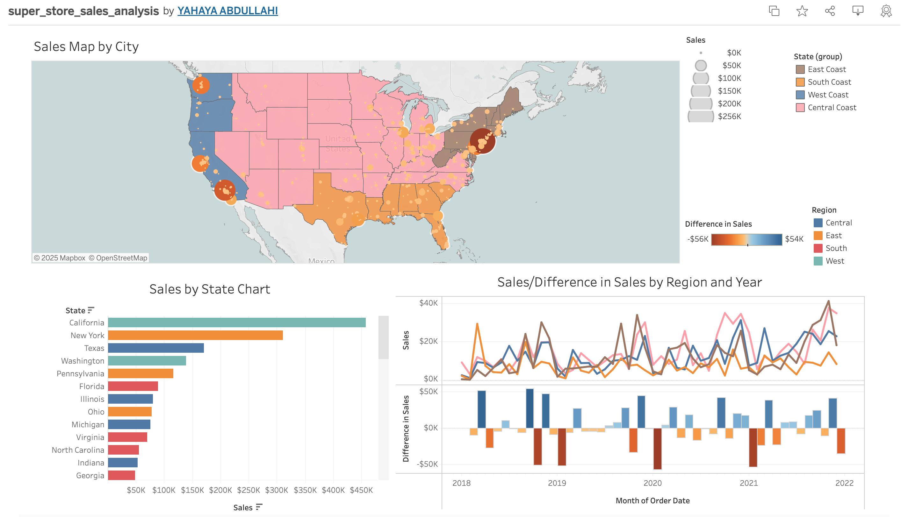

# Superstore Sales Analysis 📊  

This project showcases an **interactive sales analysis dashboard** built using **Tableau**, leveraging a **Superstore dataset** to provide insightful visualizations for data-driven decision-making.  

## 🔍 Key Features  
- **Sales Performance Trends**: Analyzing revenue patterns over time.  
- **Profitability Insights**: Identifying high-performing products and regions.  
- **Customer Segmentation**: Understanding purchasing behaviors and key demographics.  
- **Regional Sales Breakdown**: Comparing sales across different locations.  

## 📈 Dashboard Preview  
  

## 🔗 Live Dashboard  
Explore the interactive dashboard here: [Superstore Sales Analysis](https://public.tableau.com/app/profile/yahaya.abdullahi/viz/super_store_sales_analysis/Dashboard3)  

## 🚀 Getting Started  
This project is built using Tableau Software. To explore or replicate the analysis:  
1. Download the dataset (if available).  
2. Open the Tableau workbook file.  
3. Interact with the dashboard or modify it to gain further insights.  

## 💡 Inspiration  
This project was inspired by my journey of learning and mastering data visualization techniques. It serves as a demonstration of how **Tableau** can transform raw data into actionable insights.  

## 🤝 Let's Connect!  
I am always open to collaborations and discussions on data analytics, visualization, and AI-driven decision-making. Connect with me on:  
- [LinkedIn](https://www.linkedin.com/in/abdullahiyahaya-aesm)  
- [Twitter](https://twitter.com/allmenabdul)  

## 📜 License  
This project is licensed under the MIT License - see the [LICENSE](LICENSE) file for details.  
